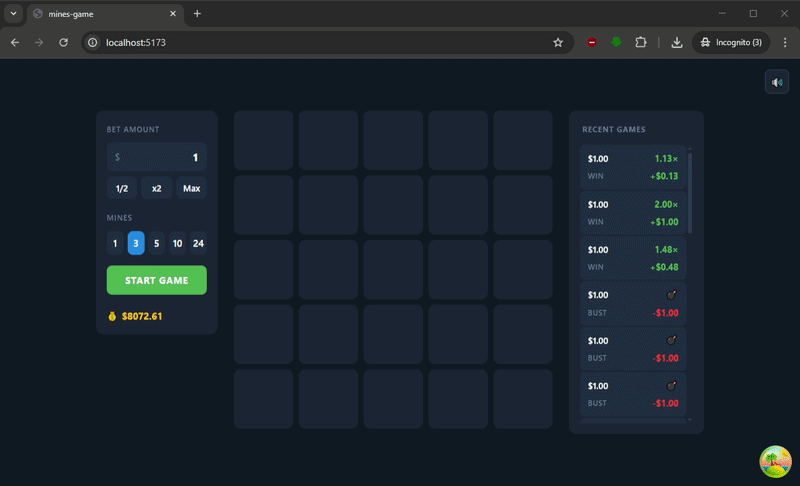

# 💎 Mines Game

A dark-themed iGaming Mines game built with React 18, TypeScript, and Vite.



---

## Overview

Mines is a provably-fair style grid game where the player selects a bet amount and number of mines, then reveals cells on a 5×5 board. Each revealed gem increases the multiplier. The player can cash out at any time — or hit a mine and lose the bet.

**Features:**

- 5×5 interactive game grid with animations
- Configurable bet amount and mines count (1, 3, 5, 10, 24)
- Real-time multiplier and profit tracking
- Cash out at any time
- Game state restoration after page reload (active game recovery)
- Win / Bust result modals
- Recent games history (desktop: vertical list, mobile: horizontal scroll)
- Sound effects for all game events with mute toggle
- Fully responsive — mobile-first layout
- Smooth animations via Framer Motion

---

## Tech Stack

| Tool                         | Details                                  |
| ---------------------------- | ---------------------------------------- |
| Vite + React 19 + TypeScript | Core stack                               |
| Zustand v5                   | Global state + persist (gameId, isMuted) |
| TanStack Query v5            | Server state, caching, mutations         |
| Framer Motion                | Animations                               |
| react-hot-toast              | Toast notifications                      |
| CSS Modules                  | Styling                                  |

---

## Getting Started

### Prerequisites

- Node.js 18+
- npm 9+

### Installation

```bash
git clone https://github.com/MykytaMusaiev/mines-game.git
cd mines-game
npm install
```

### Development

```bash
npm run dev
```

App runs at `http://localhost:5173`

### Build

```bash
npm run build
```

### Preview production build

```bash
npm run preview
```

---

## Project Structure

```
src/
├── App.tsx
├── components/
│   ├── ControlPanel/       # Bet controls, mines selector, start/cashout button
│   ├── GameCell/           # Individual grid cell with animations
│   ├── GameGrid/           # 5×5 game grid
│   ├── GamePage/           # Main page — owns all game state
│   ├── GameResultModal/    # Win / Bust result modal
│   ├── LoadingOverlay/     # App init and starting game loaders
│   ├── MuteButton/         # Fixed mute/unmute toggle
│   └── RecentGames/        # Game history sidebar / horizontal scroll
└── shared/
    ├── api/                # API client (fetch-based)
    ├── constants/          # Game constants (grid size, bet limits, etc.)
    ├── hooks/              # React Query hooks + useSound
    ├── store/              # Zustand store
    └── types/              # Shared TypeScript types
```

---

## API

**Base URL:** `https://mines-be.vercel.app`  
**Auth:** `X-Player-Id` header

| Method | Endpoint                  | Description               |
| ------ | ------------------------- | ------------------------- |
| GET    | `/api/balance`            | Player balance            |
| GET    | `/api/history`            | Last 20 games             |
| POST   | `/api/games`              | Create game               |
| GET    | `/api/games/active`       | Active game (404 if none) |
| POST   | `/api/games/{id}/reveal`  | Reveal cell               |
| POST   | `/api/games/{id}/cashout` | Cash out                  |

---

## Sounds

Place MP3 files in `/public/sounds/`:

| File          | Event             |
| ------------- | ----------------- |
| `start.mp3`   | Game started      |
| `gem.mp3`     | Gem revealed      |
| `mine.mp3`    | Mine hit          |
| `cashout.mp3` | Cash out          |
| `hover.mp3`   | Cell hover        |
| `reveal.mp3`  | Full board reveal |
